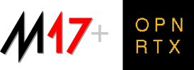

M17 is a digital radio protocol in development as an alternative to patent-encumbered, commercial protocols like DMR, D-STAR, and Yaesu System Fusion. While existing digital modes are popular, they rely heavily on the proprietary AMBE (Advanced Multi-Band Excitation) voice codec, which requires paid licensing and use of proprietary chips owned by DVSI. M17 offers similar (or even exceeding) capabilities and utilizes an open-source voice codec: Codec2.

OpenRTX firmware implements the M17 protocol on the following radios:

|Model               |Band    |Remarks                  |
|--------------------|--------|-------------------------|
|**MD-380**          |UHF     |GPS and non-GPS versions |
|**MD-390**          |UHF     |GPS and non-GPS versions |
|**RT3**             |UHF     |-                        |
|**RT3S**            |VHF/UHF |-                        |
|**MD-UV380**        |VHF/UHF |GPS and non-GPS versions |
|**MD-UV390**        |VHF/UHF |GPS and non-GPS versions |
|**CS7000-M17**      |UHF     |-                        |
|**CS7000-M17 Plus** |UHF     |-                        |
|**DM-1701**         |VHF/UHF |-                        | 

**Note:** VHF versions of the MD-380, MD-390, and RT3 currently support **RX mode only**.

### Hardware modifications

For the M17 protocol stack to work properly, a hardware modification is required (excluding the CS7000 targets). We provide detailed guides on how to disassemble and apply the modifications enabling M17 support - see the links below.

__Proceed at your own risk__. If you don't feel comfortable modding your radio, it's recommended to ask a more experienced person to help you.

 * [Modding guide for MD-380/MD-390/RT3](M17/md380_mods.md), difficulty: Easy
 * [Modding guide for MD-UV380/MD-UV390/RT3s](M17/mduv380_mods.md), difficulty: Medium
 * [Modding guide for DM-1701](https://github.com/M17-Project/DM-1701_mod), difficulty: Medium
