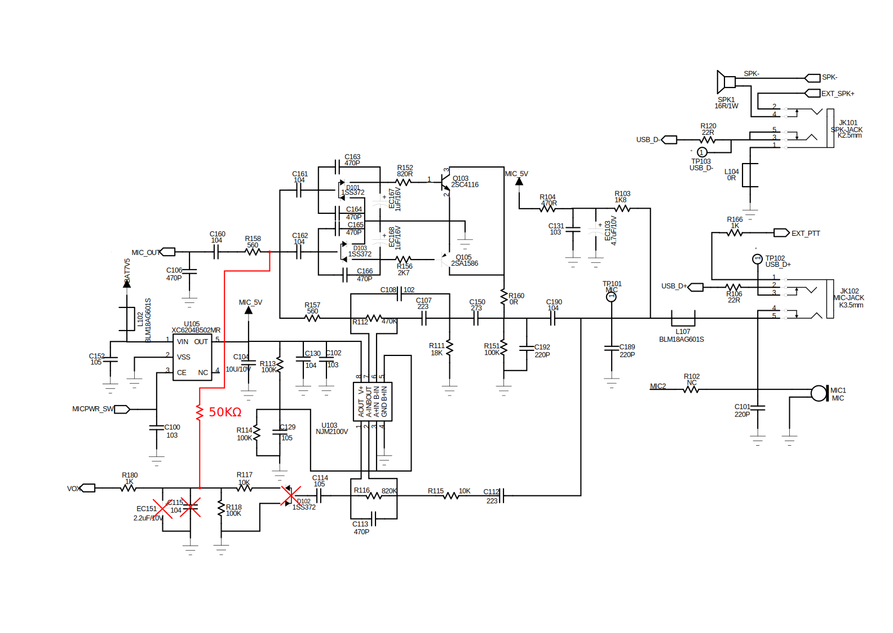
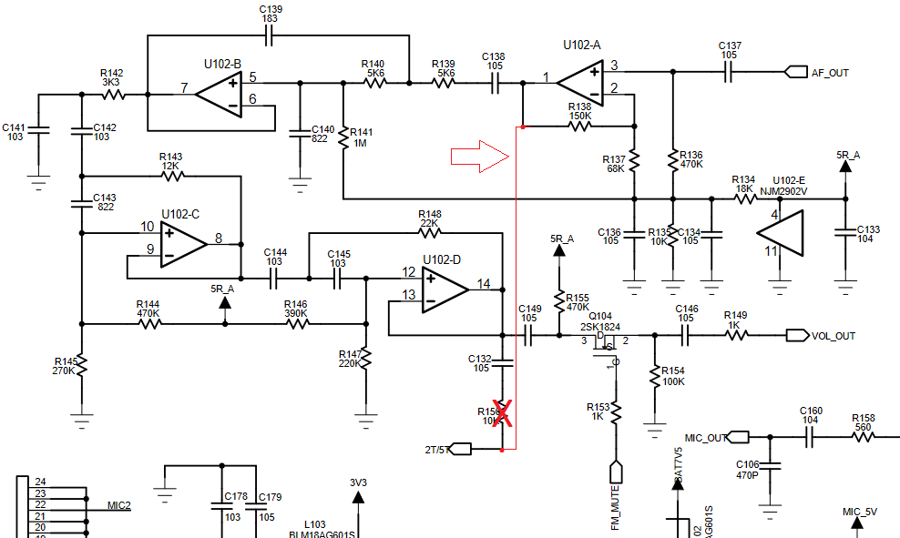
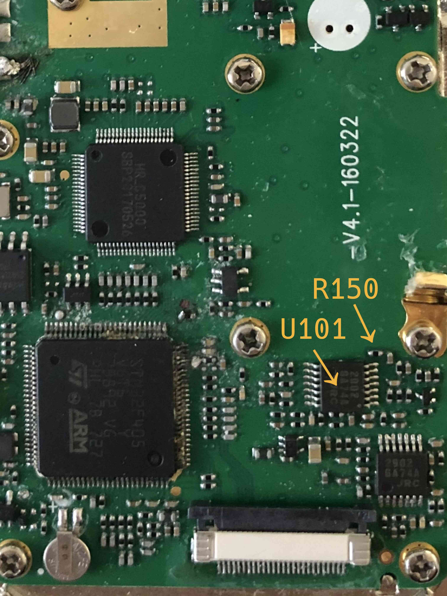
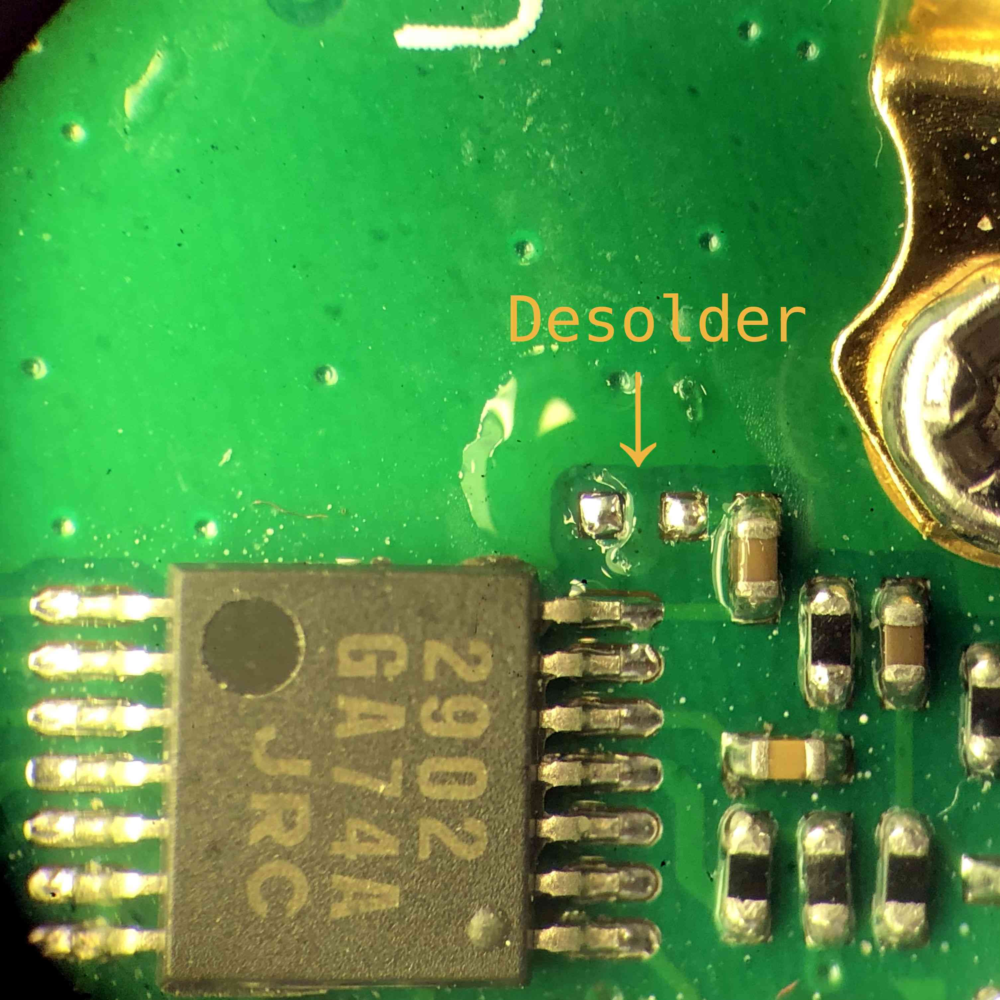
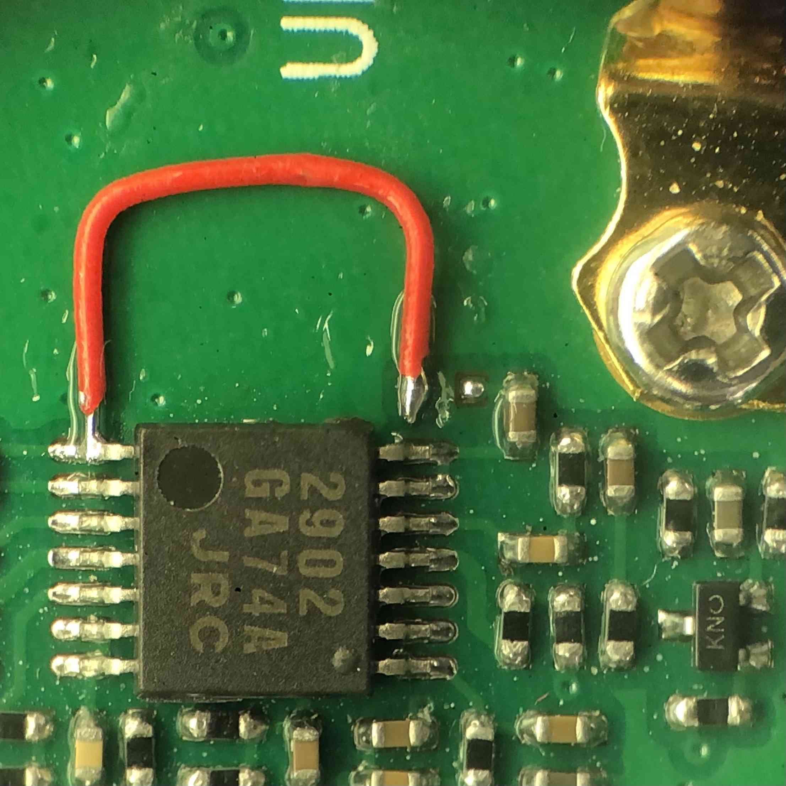
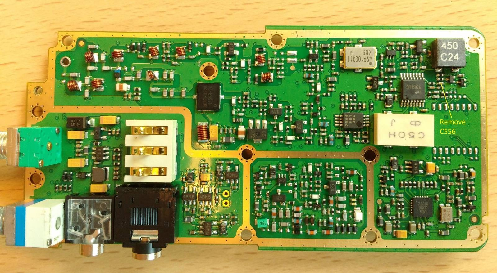

## M17 on the MD-380
We are bringing experimental M17 support to the TYT MD-380 DMR radio. However, due to technical limitations of the underlying hardware, transmitting M17 audio on the radio requires two small hardware modifications.

# __WARNING__
This guide has been updated on **01/06/2022**, if you already performed the mod before the update, you will have to perform a small modification to update your mod! \
The changes between the old and the new mod are **highlighted in yellow**, so check if they match the state of your hardware.
What has changed between the old mod and the new mod is the value and position of the resistor, and the additional removal of a capacitor.
For questions join our [community chat](get_in_touch.md), or write us an [email](https://openrtx.org/#/?id=the-openrtx-project).

### Equipment required
To perform the Mic → MCU and RF → MCU mods you need:
- Screwdrivers: Torx T6, Torx T8, Philips #0
- Plastic spudger like [this](https://it.aliexpress.com/item/32834353313.html) or similar
- 1x 50KΩ SMD (Surface Mount Device) resistor with at least 5% tolerance
- some 30AWG Kynar wire
- A small tip soldering iron
- A desoldering pump or solder wick
- (optional but recommended) 20x stereoscope like [this](https://www.amazon.it/BRESSER-8852000-Stereomicroscopio-Bresser-Junior/dp/B001UJJGV4)
- (optional but recommended) Hot glue gun to glue wires to PCB

### Disassembling the radio
- Remove the battery and the antenna
- Remove the belt clip if present
- Pull out the volume and channel knobs to remove them
- Unscrew the three nuts around the antenna connector, volume and channel knobs using a pair of
  pliers
- Unscrew the two upper screws (Torx T8) on the back and remove the plastic part they hold
- Unscrew the two lower screws (Torx T8) on the back
- Use the spudger to remove the bottom part of the aluminum heat-sink from the outer case
- Be careful when separating the heat sink from the outer case, the two are joined by the display
  flat cable and the speaker wires, which you should remove first.
- At this point you should have the internal radio assembly separated from the case

### Accessing the RF side PCB
The **RF → MCU mod requires also accessing the RF side of the PCB**,
the one which faces the heat sink.

- Remove the 11 Philips #0 screws from the logic side of the PCB \
- Remove the 2 Torx T6 screws from the side button PCB \
- Desolder the antenna connector \
The antenna connector is fixed to the heat sink with two screws,
removing them should NOT be necessary to perform the mod
- Use a pair of tweezers or a spudger to gently pull the side button PCB out of the heat sink. \
Be careful not to break the solder joints between the button PCB and the main PCB. \
- Now carefully detach the heat sink from the PCB assembly, you should be able to see the RF side of
  the PCB. \

### Mic → MCU
The modification enables the MCU on the radio to directly access the audio signal coming from the microphone, bypassing the HR_C5000 normally used to sample microphone input.
We cannot use the HR_C5000 ADCs, because those can be accessed only in DMR mode, and we are leveraging HR_C5000 analog FM mode to transmit M17 data.

The MD-380 has already access to the microphone input, this is used for the VOX function in the original firmware, however this input is heavily filtered, which results in an analog bandwidth which is too narrow to be used for voice input.
Instead we pick up the signal from the MIC_OUT line, which is used for the voice input and feed it to the VOX line, so that it can be sampled by the MCU.

The modification itself is quite small, we need to remove the EC151 capacitor and remove the D102 diode. \
Here is the mod, represented on the schematic of the radio: \

This is the logic board of the TYT MD-380:

We are going to remove EC151 and remove D102, this is a picture of the two components before the modification:

After the modification:

Lastly, since STM32 ADCs can only measure positive voltages, to be able to capture the full audio signal we need a DC biased microphone signal.
We are going to take the microphone signal at R158 which is DC biased in the range 0-5V and bridge it to R118 where we want an input range of 0-3.3V.
We recommend to do so by applying a 50KΩ resistor between *C161 or C162 or both* and the microphone signal path, accessible on one of the pads of the EC151 capacitor we just removed.
If you don't have a 50KΩ resistor, anything in the range [40-60]KΩ will work.
Finally, remove the C115 capacitor.

Here is a picture of the applied modification:

This modification has a minor impact on the VOX functionality on any firmware different than OpenRTX. The VOX level 1 will be always open, higher VOX levels still work as expected. When VOX functionality will be implemented on OpenRTX, we'll take care to support both modified and unmodified MD-380 radios.

### RF → MCU
The MD380 already features a signal path from the FM demodulator to the MCU, marked on the schematic as 2T/5T, probably meant to be used for ZVEI Selcall, but never implemented in the original firmware.
This audio path however has a very narrow pass-band filter, and cannot be used as-is to demodulate M17.

We will break the original 2T/5T path by removing R150 and re-use the STM32 pin to create a new, unfiltered path, from the demodulator output, to one of the STM32 ADCs.

In this second part of the mod we'll be working on the lower right portion of the logic side of the PCB, in this picture you can see the unmodified portion of the radio:

First we will desolder R150: put some flux, heat one side of the resistor, slide it away on one side, heat the other side and slide it away on the other side, heat the pads to clean them up.
This is how the pads should look like after the resistor has been removed:

Afterward we will bridge with some Kynar wire the left pad of the resistor (2T/5T) with pin 1 of U102, which is the demodulator output. Here is a picture of the finished modification:

The path from the FM demodulator to the MCU includes a low-pass filter, this filter needs to be removed to be able to demodulate M17. \
The filter can be removed by **desoldering the C556 capacitor from the RF side PCB.**

### Results

You can put some drops of hot glue to ensure that the resistor and the Kynar wire stay in place.
