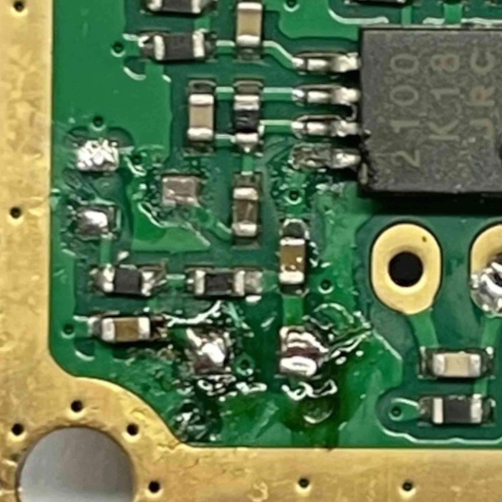
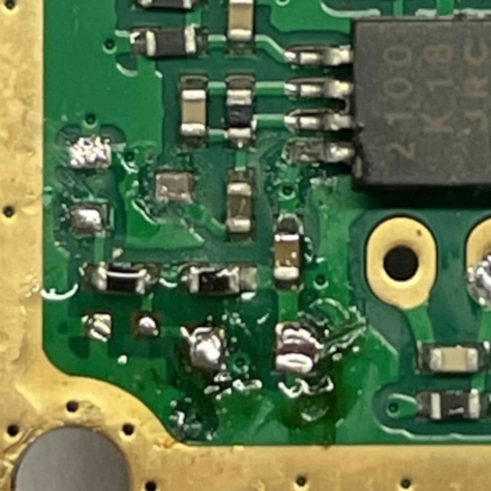
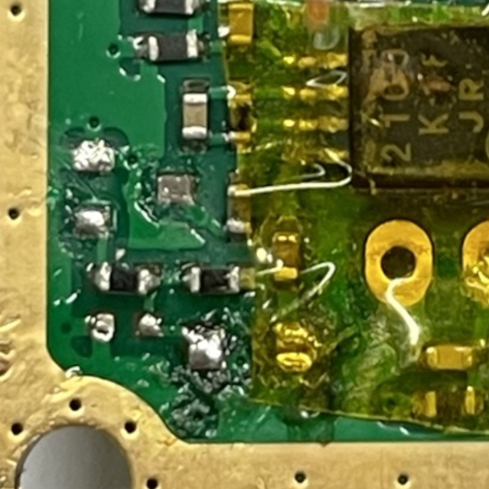
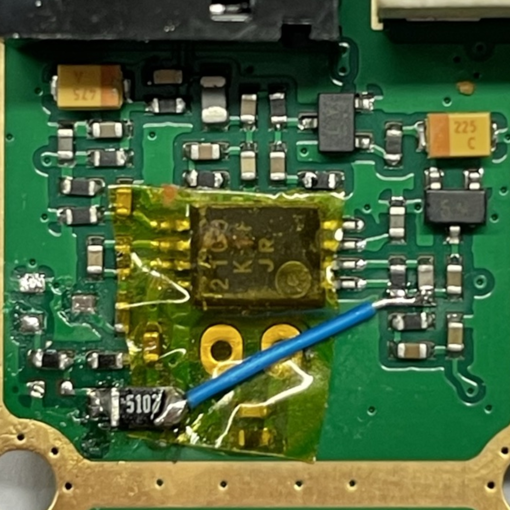

## M17 on the MD-UV380
The Tytera MD-UV380 uses a HR_C6000 DMR baseband, that cannot be repurposed to run M17.
M17 can be encoded and decoded by using the radio MCU, to do so we need to ensure to have the
necessary audio paths between MCU, RF part, speaker and microphone.

There are two audio paths that require some hardware modifications:
- MCU → Spk: Available
- MCU → RF: Available
- Mic → MCU: Requires hardware mod
- RF → MCU: Requires hardware mod

# __WARNING__
This guide has been updated on **18/09/2021**, if you already performed the mod before the update, you will have to perform a small modification to update your mod! \
The changes between the old and the new mod are **highlighted in yellow**, so check if they match the state of your hardware.
What has changed between the old mod and the new mod is the value and position of the resistor, and the additional removal of a capacitor.
For questions join our [community chat](get_in_touch.md), or write us an [email](https://openrtx.org/#/?id=the-openrtx-project).

### Equipment required
To perform the Mic → MCU and RF → MCU mods you need:
- Screwdrivers: Torx T6, Torx T8, Philips #0
- Plastic spudger like [this](https://it.aliexpress.com/item/32834353313.html) or similar
- 1x **50KΩ SMD (Surface Mount Device)** resistor with at least 5% tolerance
- some 30AWG Kynar wire
- A small tip soldering iron
- A desoldering pump or solder wick
- A file to create a small groove on the aluminum heat sink
- (optional but recommended) 20x stereoscope like [this](https://www.amazon.it/BRESSER-8852000-Stereomicroscopio-Bresser-Junior/dp/B001UJJGV4)
- (optional but recommended) Hot glue gun to glue wires to PCB

### Disassembling the radio
- Remove the battery and the antenna
- Remove the belt clip if present
- Pull out the volume and channel knobs to remove them
- Unscrew the three nuts around the antenna connector, volume and channel knobs using a pair of
  pliers
- Unscrew the two upper screws (Torx T8) on the back and remove the plastic part they hold
- Unscrew the two lower screws (Torx T8) on the back
- Use the spudger to remove the bottom part of the aluminum heat-sink from the outer case
- Be careful when separating the heat sink from the outer case, the two are joined by the display
  flat cable and the speaker wires, which you should remove first.
- At this point you should have the internal radio assembly separated from the case\
(Ignore the green and blue wires, they were used to sniff the AT1846S I2C bus)\

### Accessing the RF side PCB
Both mods (Mic → MCU and RF → MCU) require accessing the RF side of the PCB, 
the one which faces the heat sink.

- Remove the 11 Philips #0 screws from the logic side of the PCB \

- Remove the 2 Torx T6 screws from the side button PCB \

- Desolder the antenna connector as shown in the picture \
The antenna connector is fixed to the heat sink with two screws,
removing them should NOT be necessary to perform the mod

- Use a pair of tweezers or a spudger to gently pull the side button PCB out of the heat sink. \
Be careful not to break the solder joints between the button PCB and the main PCB. \

- Now carefully detach the heat sink from the PCB assembly, you should be able to see the RF side of
  the PCB. \

### Mic → MCU
The MD-UV380 like the MD380 has an audio path from the microphone to the MCU that is used for VOX
functionality on the stock firmware.

The Mic → MCU mod consists in **breaking the original VOX audio path and connecting the VOX
MCU input to the microphone preamplified audio signal, adding a resistor to adapt the
signal voltage range from 0-5V to 0-3.3V**

**Here is the mod, represented on the schematic of the radio:** \

**And here is a diagram showing how it appears on the radio:** \

Steps:
- Remove the capacitor shown in the picture, you can use the hot air gun from a rework station or \
  you can melt the solder in the two contacts and rotate slightly the capacitor to remove it.
  Be careful to not damange the PCB tracks.
- **Remove the D102 diode (SOT-23) and capacitor EC151 entirely.** \

- **Remove the C115 capacitor (SMD) entirely.** \

- **Cover the PCB in Kaptop tape leaving the left pad of the first capacitor you removed accessible.** \

- **Solder the 50KΩ SMD resistor on the left pad of EC151.** \

- **Solder a piece of Kynar wire from the right pad of the resistor you just soldered to C161 or C162 or both.** \

**The Mic → MCU mod is now complete, go share it on your favourite social network!**

### RF → MCU
The MD-UV380 lacks a direct path from the demodulated RF signal coming from the AT1856S
radio-on-a-chip to the STM32 MCU.
We are going to create it by connecting the `ADC_IVINP` of the HR_C6000 baseband to the `PC13` pin
of the STM32 which can be configured as an ADC input.

An inconvenient of this mod is that the HR_C6000 and STM32 are on opposite sides of the PCB. \
We will use an alignment notch on the PCB to pass the wire, usually this notch matches a pin on the
aluminum heat sink.\

Steps:
- We need to file down the pin and create a small groove in place to avoid pinching the wire. \
Note that on my radio for some reason the pin was removed at the factory, so you may have it or not. \

- Cut a section of 30AWG Kynar wire, strip and tin one end.
- The `ADC_IVINP` is on the upper side of the HR_C6000, and the wire can be soldered on two \
  pins of a resistor and capacitor that are connected together. This makes the soldering easier and \
  gives it more mechanical strenght. \

- Use the tweezers to bend the wire to route it towards the notch in the PCB. 
  Make sure that the wire lays flat on the PCB. \

- Bend the wire on the notch toward the logic side of the PCB. \

- Use the tweezers to route the wire towards the left side of the STM32. \

- Trim and tin the other end of the wire and solder it on pin 18 of the STM32. \

- Check that the wire does not get pinched by the heat sink, in case it does, file a deeper groove.

### Results
- The final results with both mods applied should look like this (ignore the green and blue wires).\

- Close the heat sink over the PCB, paying attention to the side keys PCB.
- Make sure that the antenna connector is screwed exactly perpendicular to the rest of the radio
- Solder the antenna connector pin
- Reassemble the radio by following the disassembly instructions backwards.
- TIP: If you plan to disassemble the radio again shortly, reassemble it without the rubber gasket.\
  It will make disassembling it again easier.
