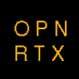

<!-- _coverpage.md -->

# OpenRTX <small>0.3</small>

> Free and Open Source Firmware for Digital Ham Radios

Top-down designed with modularity, flexibility and performance in mind.

[GitHub](https://github.com/OpenRTX/OpenRTX/)
<a rel="me" href="https://mastodon.radio/@openrtx">Mastodon</a>
[X](https://x.com/OpenRtx)
[Matrix](https://matrix.to/#/#openrtx:matrix.org)
[Get Started](#the-openrtx-project)
[Donate](https://liberapay.com/OpenRTX/donate)

