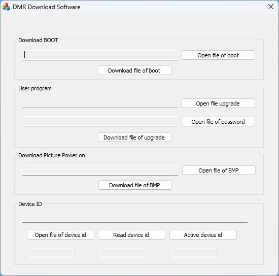
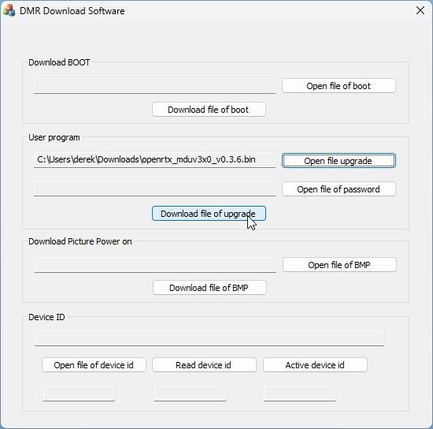
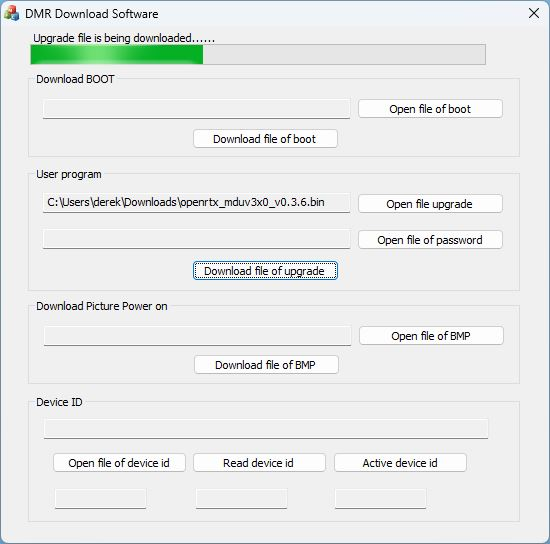
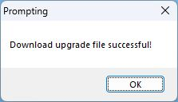
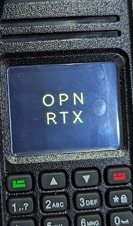

# Windows - Flash OpenRTX to MD-3x0 & MD-UV380 Radios

This section describes how to flash OpenRTX onto the MD-3x0 & MD-UV380 series of hardware from Windows.

This documentation was developed using an Retevis RT3S (MD-UV380 equivalent).

## Compatibility

MD-UV380, MD-380, or MD-390 radios running:

- Stock OEM firmware
- OpenGD77 firmware
- Existing install of OpenRTX firmware

## Firmware Upgrade Application

Refer to the hardware manufacturer for the recommended firmware upgrade utility.

For the purpose of this help file, Retevis technical support provided a direct link to download *FirmwareDownloadV3.04_EN.exe*. 

For reference, md5 hash of file provided by Retevis:

```text
md5sum -t FirmwareDownloadV3.04_EN.exe 
e561f018f1516c755741b15cdc1369fd  FirmwareDownloadV3.04_EN.exe
```

**Note**: Exercise caution when downloading anything from unknown sources.

## OpenRTX firmware

Building OpenRTX from source is outside the scope of this section. 

To download the latest release see [OpenRTX Github repo releases](https://github.com/OpenRTX/OpenRTX/releases) and select the 'openrtx_mduv380_v*x.x.x*.bin' file or applicable file for target device.

## Radio Upload/DFU mode

1. Turn off radio with power knob
2. Press and Hold the PTT button and the top button (above PTT) on the side of the radio
3. Turn on the radio with the power knob

The radio power LED (next to the Power knob) should slowly alternate between red & green to indicate the radio is in the proper mode for update.

The radio display is expected to be off and showing no information.

## Connect radio to PC

Using USB -> K1 connector adapter compatible with the radio, connect the radio to your PC.

## Firmware update process

### UpgradeDownload.exe - "DMR Download Software"

By default *FirmwareDownloadV3.04_EN.exe* provided by Retevis installs *DMR Download Software* in the file path *C:\Program Files (x86)\FirmwareDownloadV3.04\DMR Firmware DownLoad v3.04_En*.

#### Software overview

The software is shown below.



For flashing *OpenRTX*, only the User Program section is used.

#### Execute firmware upgrade

Procedure for upgrade:

1. Ensure radio is in DFU mode using process and verifications above.
2. Click on *Open file upgrade' and select the firmware bin file compiled or downloaded previously.
3. Select *Download file of upgrade* as shown below.

    

4. Download will start as shown below

    

5. Downloading success message shown below.

    

6. Unplug USB cable and power cycle radio
7. MD-UV380 boot message will show OpenRTX logo

    

### Troubleshooting

#### DMR Download Software - Failed USB open

The error shown below could indicate an incorrect driver or incorrect radio mode.


Refer to [Windows Drivers for STM32 DFU Mode](./win-stm32drivers.md)