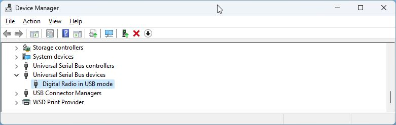

# Windows Drivers for STM32 DFU Mode

## Device Manager Examples

Examples shown below of device manager showing radio in various modes.

### Device Manager with radio in DFU/Update mode

The following image is the expected Device Manager entry to support firmware flashing.

### Device Manager with radio in DFU/Update mode, incorrect driver

The following image shows the Windows Device Manager with the Radio connected using the wrong driver.

### Device Manager with radio in DFU mode, no driver

### Device Manager with radio in normal operation mode

The follow image shows Windows Device Manager when the radio is in the operational mode and has correct drivers installed. This is the incorrect mode flashing firmware.

### Device Manager with radio in normal operation mode, no device drivers

The following image shows Windows Device Manager when the radio firmware drivers have not been installed.

Refer to Manufacturer's website for approved device drivers.

## Replace driver with DFU mode driver

The functional DFU drivers can be retrieved from [ST Microelectronics' DFUse installer](https://www.st.com/en/development-tools/stsw-stm32080.html). Registration may be required to download.

The installer for this software package will install the DFU drivers into the folder *C:\Program Files (x86)\STMicroelectronics\Software\DfuSe v3.0.6\Bin\Driver\Win10*

1. Right click on the incorrect driver in Device Manager, click Uninstall Driver and select the 'Attempt to remove the driver for this device' checkbox in the pop-up window.
2. Allow to uninstall.  
3. Unplug and then plug in the radio to allow to enumerate. Look for the driver [as shown above in Radio in DFU mode with no DFU driver](#device-manager-with-radio-in-dfu-mode-no-driver)
4. Right click on the '! Digital Radio in USB Mode' and select *Update Driver*, then *Browse my computer for Drivers*. Enter the path to the driver(s), be sure to check the *Include Subfolders* box and select *Next*
5. Driver should install and show in Device Manage [as shown at the top of this page](#device-manager-with-radio-in-dfuupdate-mode).
