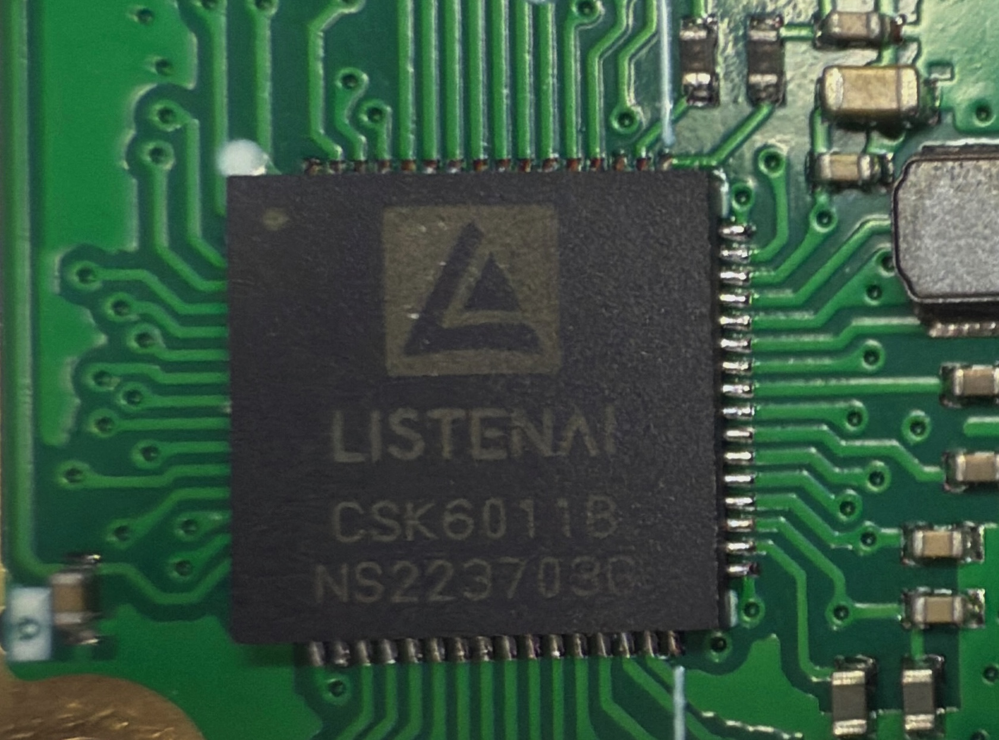
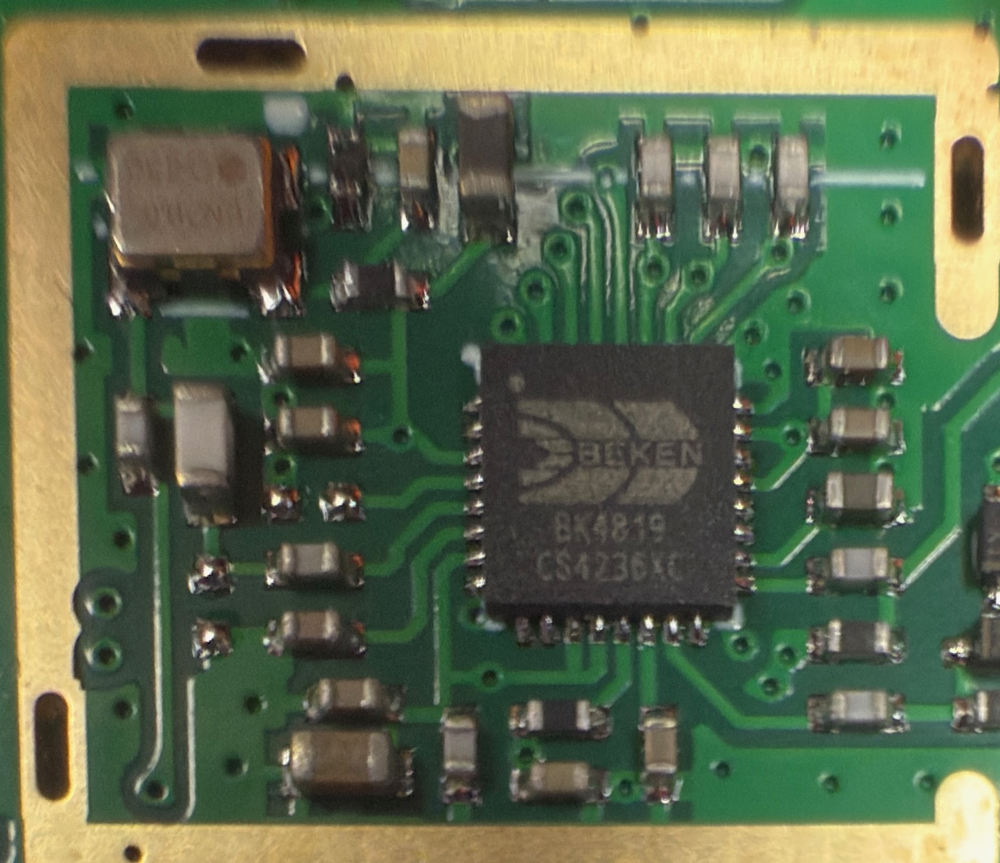
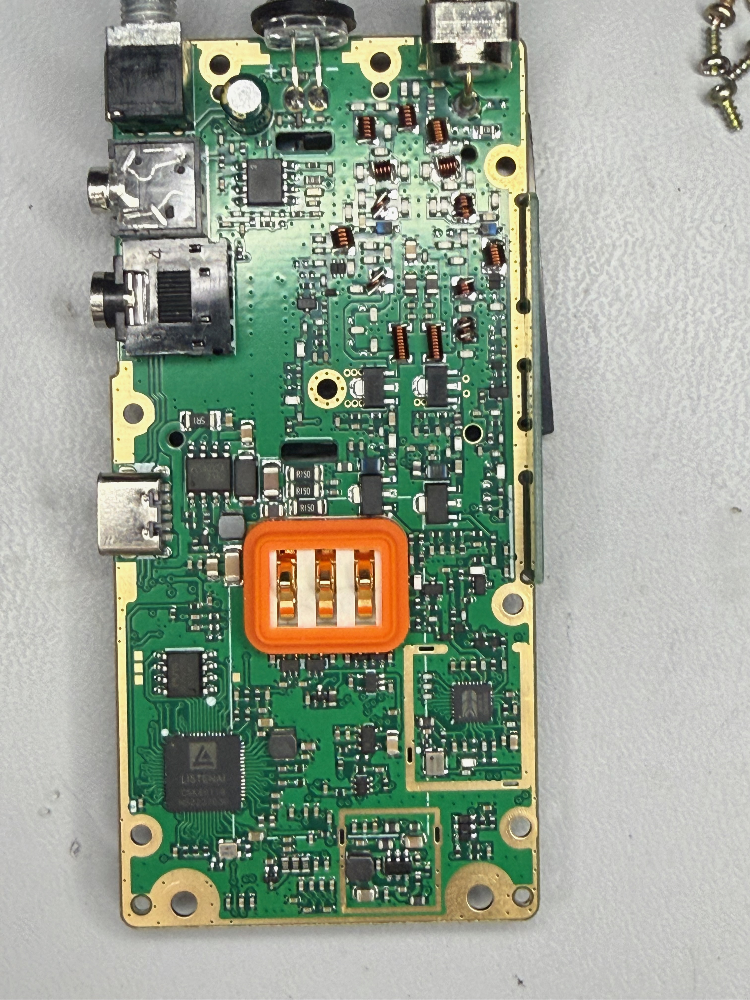

# Retevis C62

## Development Status

There is a functional port for OpenRTX currently in development. Right now, the main functions (boot, display, keys) function as expected. However, there has been a significant challenge in getting the DSP coprocessor to cooperate to allow for audio in/out, including for analog FM. For now, There is a workaround for FM RX (and only RX) that involves an ET3157 analog switch that is present on the board; it allows for the BK4819's "earphone output" to be piped directly to the speaker.

**⚠️ Important Note: The Retevis C62 is not yet ready to run M17 protocol. While the hardware is capable of supporting M17, firmware development is currently in progress.**

The C62 was identified as a candidate for M17 development after discovering an undocumented DMR-like digital mode in its factory firmware, which prompted investigation into its suitability for open-source protocol implementation.

## Device Models
- Retevis C62 5W Long Range UV Dual Band Business Radio

## Specifications

### General Specifications
* **Power Output**: 5W
* **Frequency Bands**: Dual Band (136-174, 400-520MHz. Chip technically capable of 18-1300MHz; feasible range TBD)
* **Display**: ST7735R display controller
* **Battery**: TBD
* **AI Noise Reduction**: Built-in AI noise reduction technology

## Hardware Configuration

### Key Components
* **Main MCU**: ListenAI CSK6011B
* **RF Front-end**: BK4819 (same chip used in UV-K5 radios)
* **FM Receiver**: BK1080

### Hardware Images

#### Main Processor (CSK6011B)


#### RF Front-end (BK4819)


#### Main Board Overview


## Development Environment

### Docker Setup
The C62 development environment uses Docker for cross-platform compatibility:

```bash
docker run --platform linux/amd64 --privileged -v /dev:/dev -v /run/udev:/run/udev -it listenai/csk6:latest
```

**Note**: The `--platform linux/amd64` flag is required only when developing on M-series Mac computers.

### Required Hardware
* **Programming Cable**: TalkPod A36 (recommended)
* **Debug Access**: Debug pads located on opposite side of CSK6011B chip

## Firmware Development

### Firmware Extraction
To extract the original firmware for analysis:

```bash
cskburn --read "0x0000000:4096000:app.bin" -C 6 -b 115200 -v -s {device}
```

**Parameters:**
- `0x0000000:4096000:app.bin`: Read 4MB starting from address 0x0
- `-C 6`: Communication parameter 6
- `-b 115200`: Baud rate 115200
- `-v`: Verbose output
- `-s {device}`: Specify device path

### Development Tools
* **Reverse Engineering**: Ghidra with armv8-LE processor definitions
* **Firmware Tool**: Modified cskburn from OE3ANC

## Hardware Disassembly

### Disassembly Process
1. Remove 4 corner screws from the radio case
2. Carefully disconnect the volume knob
3. Disconnect the antenna connection
4. Remove the screen carefully (secured by 2 clips)
5. Separate internal components to access main board
6. Locate debug pads on the opposite side of the CSK6011B chip

**⚠️ Caution**: Handle internal components with care, especially the screen and cable connections.

## Build Instructions

### Development Environment Setup
1. Install Docker on your development machine
2. Pull the ListenAI CSK6 development image:
   ```bash
   docker pull listenai/csk6:latest
   ```
3. Run the development container with appropriate permissions
4. Set up the modified cskburn tool for firmware operations

### Firmware Development Status
* **Current Status**: Firmware development in progress
* **Memory Mapping**: Incomplete - community contributions welcome
* **Decompilation**: Partial success with Ghidra armv8-LE definitions
* **Target Protocol**: M17 implementation planned

## Technical Notes

### Unique Characteristics
* Undocumented digital mode discovered in factory firmware
* Shares BK4819 RF chip with popular UV-K5 platform
* ListenAI CSK6011B processor offers development potential
* Hardware architecture suitable for M17 protocol implementation

### Development Challenges
* Incomplete memory map requires further reverse engineering
* Decompilation accuracy needs improvement
* Community contributions needed for complete chip understanding

### Hardware Compatibility
* BK4819 RF chip provides proven radio frequency performance
* CSK6011B processor architecture supports complex protocol development
* Hardware debugging access available through exposed pads

## Community Development

The C62 development effort welcomes community contributions, particularly in:
* Complete memory map development
* Improved decompilation accuracy
* M17 protocol firmware implementation
* Hardware debugging and analysis

---

*Hardware analysis and development information from:*
- *GitHub Repository: https://github.com/JKI757/C62_Teardown*
- *Official Product Information: https://www.retevis.com/retevis-c62-5-w-long-range-uv-dual-band-ai-noise-reducation-business-radio-us*
