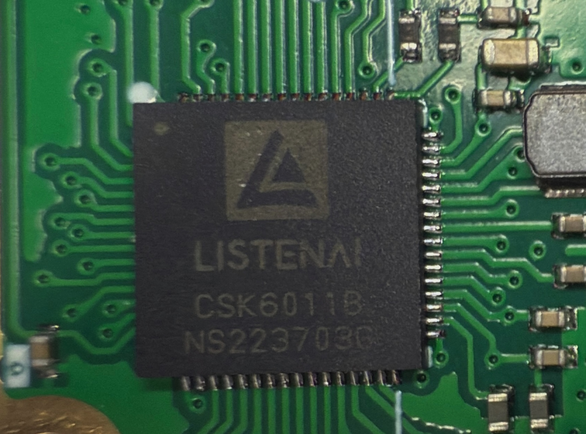
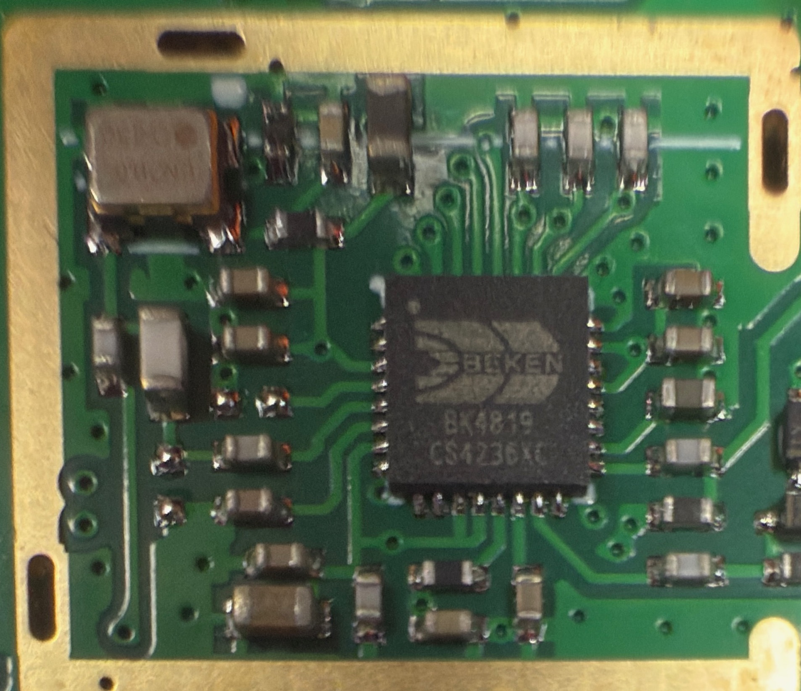
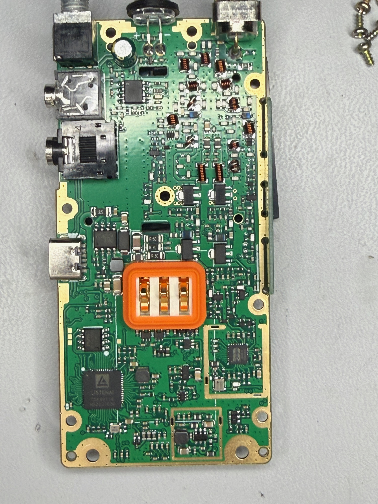

# Retevis C62

The Retevis C62 is a 5 W dual-band handheld built around a ListenAI CSK6011B, a
multi-core SoC that pairs an ARM Cortex-M33 application core with a Cadence HiFi4
DSP and a small NPU. The DSP and NPU drive the radio's "AI noise reduction". RF
is handled by a BK4819, the same chip found in the Quansheng UV-K5, with a BK1080
for broadcast FM.

## Development status

This is a work in progress, not a finished firmware. What works today on the
[`retevis_c62-pr`](https://github.com/OpenRTX/OpenRTX/pull/415) branch:

- Boot, display, keypad
- Analog FM RX and TX

M17 and other digital modes do not work yet. The blocker is audio. The
CSK6011B's ADC and DAC are owned by the HiFi4 DSP, and OpenRTX reaches them
through a closed-source DSP firmware from ListenAI's SDK (see
[DSP firmware](#dsp-firmware) below). That firmware only samples at 16 kHz,
whereas M17 needs 24 kHz, so the receive path requires a resampling stage that is
still under development.

## Specifications

* **MCU**: ListenAI CSK6011B (Cortex-M33, HiFi4 DSP, NPU)
* **RF front-end**: BK4819 (as in the UV-K5)
* **Broadcast FM**: BK1080
* **Display**: ST7735R
* **Flash**: 4 MB SPI NOR (PY25Q32HB)
* **Battery**: Retevis BL2, 2S Li-ion, 2 Ah, 14.8 Wh
* **Power output**: 5 W
* **Bands**: 136 to 174 MHz and 400 to 520 MHz. The BK4819 covers a much wider
  range, the usable range on this hardware is still TBD.

### Hardware images

#### Main processor (CSK6011B)


#### RF front-end (BK4819)


#### Main board overview


## Programming cable and entering burn mode

All of the steps below run over the Kenwood-style speaker/mic jack, so there is
no need to open the radio. Any Baofeng/Kenwood K-plug USB cable works, and a
TalkPod A36 cable is also confirmed. The boot ROM's UART shares pins with the PTT
lines, which is why the entry procedure matters.

`cskburn` normally drives the BOOT and RESET pins over RTS/DTR, but a two-wire
radio cable exposes neither. On the C62 the CSK6011B enters UART burn mode when
its `GPIO_B_01` strap is held low at power-on, and that pin is wired to the
**secondary PTT**, the lower side key. The sequence is:

1. Radio **off**.
2. Hold the **secondary PTT** (lower side button).
3. Power the radio on, then release the button.

The screen stays dark in burn mode. That is expected, not a dead radio. Do not
press the main PTT while flashing, because that line is the boot-ROM UART RX. If
a command reports "device did not respond after reset", the radio was not in burn
mode. Repeat the sequence.

## cskburn

Flashing and dumping use [`cskburn`](https://github.com/LISTENAI/cskburn).
Download a prebuilt binary from its releases page. The CSK6 chip family is
selected with `-C 6`. Reading flash uses the `--read` option.

A reliable serial adapter matters more here than usual. FTDI-based cables often
refuse baud rates above 115200 with `cskburn`, and some PL2303 clones stall
during long sustained reads. Use 115200 unless your adapter is known to handle
more.

## Backing up the factory firmware

Do this before flashing anything, as it is the only way back. The flash is 4 MB,
so read the full `4194304` bytes:

```bash
cskburn --read "0x0:4194304:factory.bin" -C 6 -b 115200 -v -s /dev/ttyUSB0
```

If the read stops partway through, which flaky adapters do on the full 4 MB, read
it in smaller regions and concatenate them. `cskburn` accepts several `--read`
arguments in one session, and `--no-reset` keeps the radio in burn mode between
regions:

```bash
cskburn --read "0x0:0x100000:p0.bin" \
        --read "0x100000:0x100000:p1.bin" \
        --read "0x200000:0x100000:p2.bin" \
        --read "0x300000:0x100000:p3.bin" \
        --no-reset -C 6 -b 115200 -s /dev/ttyUSB0
cat p0.bin p1.bin p2.bin p3.bin > factory.bin
```

Factory images are per-device. There is a serial number and calibration blob
around offset `0xA4010`, so an image from one radio will not run correctly on
another. Name your dumps by serial number.

## Building

The board target lives on the `retevis_c62-pr` branch of OpenRTX and builds
against ListenAI's Zephyr fork (Zephyr 3.1 era, hardware model v1). Mainline
Zephyr does not contain CSK6 support. The branch's `west.yml` references an
upstream Zephyr revision, but the working build uses the fork that ships inside
ListenAI's container image, so the simplest path is to build in that container.

```bash
docker pull listenai/csk6:latest
# --platform linux/amd64 is only needed on Apple silicon
docker run --privileged -v /dev:/dev -v /run/udev:/run/udev \
           -v "$PWD":/OpenRTX -it listenai/csk6:latest
```

Inside the container, from the repository checkout:

```bash
lisa zep exec ./run_build_c62.sh
```

`run_build_c62.sh` drives the build through Meson. Its `openrtx_c62` target runs
`west update --group-filter +c62` to pull the C62-only dependencies, then
`west build -b c62`. Two things to know:

- The stock image does not ship Meson. Install it first with
  `pip install meson` inside the container.
- The C62-specific modules (`af`, `lsf`, `urpc`, `freertos_shims`) are only
  fetched when the `+c62` west group is enabled, which is why the build passes
  `--group-filter +c62`.

The output is `build/zephyr/zephyr.hex`, roughly 340 kB of code. RAM is the tight
resource, sitting around two-thirds full.

## Flashing OpenRTX

Put the radio in burn mode, then write the application at `0x0`:

```bash
cskburn -s /dev/ttyUSB0 -C 6 -b 115200 0x000000 build/zephyr/zephyr.hex
```

A build that uses the DSP for audio, meaning anything beyond the FM-RX analog
workaround, also needs the DSP firmware at `0x100000`, described below.
`cskburn` resets the radio when it finishes, so re-enter burn mode before each
command. All OpenRTX log output returns over the same UART at 115200.

To restore the factory firmware, write your backup at `0x0` the same way.

## DSP firmware

Audio on this radio does not run on the Cortex-M33. The CSK6011B's ADC and DAC
belong to the HiFi4 DSP, and the M33 reaches them by remote procedure calls to a
firmware image running on the DSP. OpenRTX loads that image from flash at boot,
from the `dsp_firmware` partition at `0x100000`.

There is no open DSP firmware yet, so the port uses the example blob from
ListenAI's [`lsf-zephyr-sdk`](https://cloud.listenai.com/listenai/lsf-zephyr-sdk),
found at `resources/dsp_firmware.bin` (about 443 kB). Flash it once:

```bash
cskburn -s /dev/ttyUSB0 -C 6 -b 115200 0x100000 dsp_firmware.bin
```

Two blobs are in circulation. The one in `lsf-zephyr-sdk` works. The smaller one
in the separate `lsf-dsp-firmware` repository does not, because its RPC bindings
do not match. The radio's own factory DSP firmware, whose header starts with
`IFLY` (iFlytek), uses a different and undocumented RPC protocol and cannot be
reused as-is.

The example blob is a HiFi4 build of an Android-style AudioFlinger and AudioMixer
stack plus a WebAssembly runtime for the NPU. Its limitations are what currently
hold back M17. It only exposes 16 kHz sampling, and it logs to the same UART pins
OpenRTX uses. A proper open DSP firmware, or ListenAI releasing the example
source, is the preferred long-term fix.

## Reverse engineering

The DSP core is Xtensa HiFi4. In Ghidra, `Xtensa:LE:32:default` produces
reasonable disassembly for the DSP portions. The NPU and WASM parts are a
separate problem. It is a custom Xtensa configuration with TIE and FLIX
extensions, so some instructions fall outside Ghidra's stock processor module.
The Cadence `venus_hifi4` core bundle documents them.

Building your own DSP code is possible without a paid license. The Cadence
XtensaTools RI-2021.7 toolchain and the `venus_hifi4` core files are
downloadable, and once the core parameters are fixed up they build for
`XTENSA_CORE=venus_hifi4`. This is not needed to run OpenRTX. It matters only for
lifting the 16 kHz limit or writing a fully open DSP firmware.

## References

- [OpenRTX C62 support PR](https://github.com/OpenRTX/OpenRTX/pull/415)
- [C62 teardown, pinout and schematics](https://github.com/JKI757/C62_Teardown)
- [cskburn](https://github.com/LISTENAI/cskburn)
- [ListenAI LSF Zephyr SDK](https://cloud.listenai.com/listenai/lsf-zephyr-sdk)
- [Product page](https://www.retevis.com/retevis-c62-5-w-long-range-uv-dual-band-ai-noise-reducation-business-radio-us)
