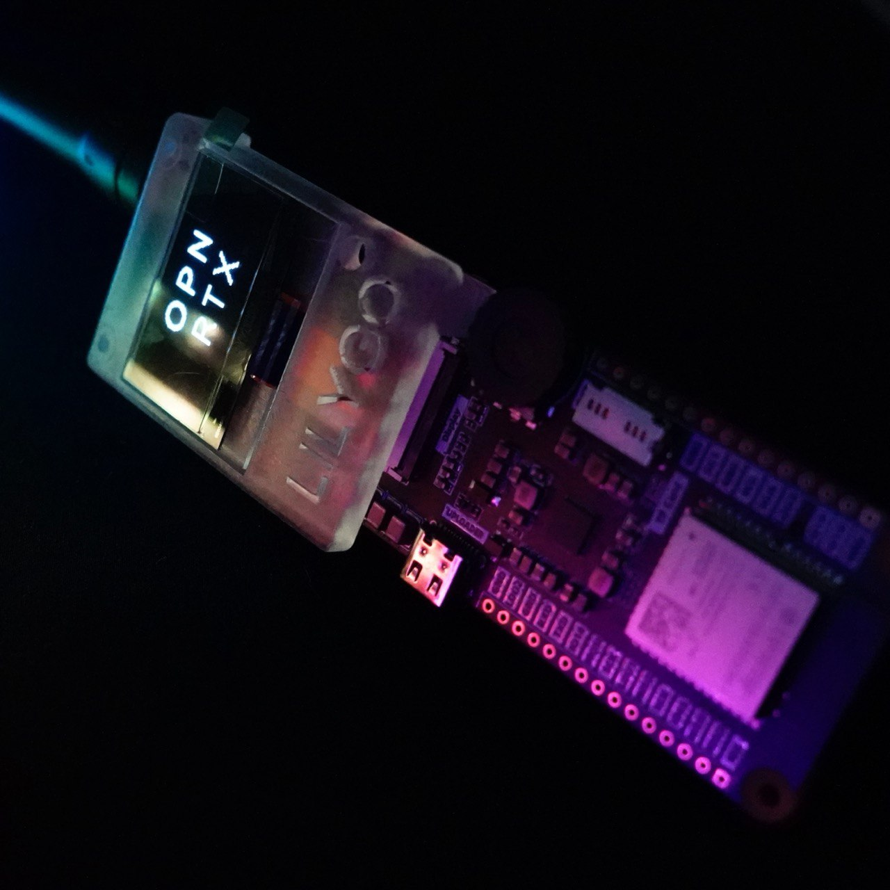
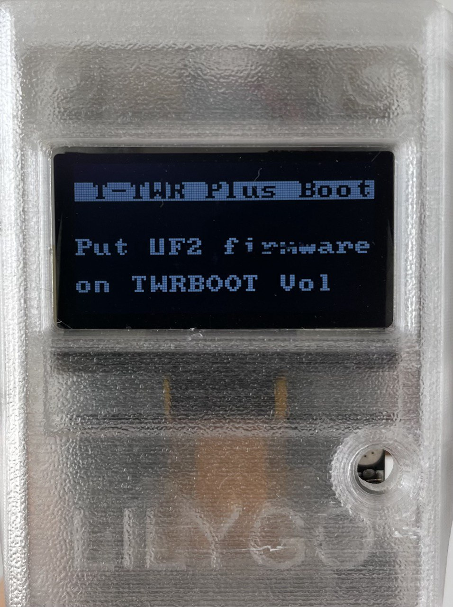

# LILYGO T-TWR Plus



The T-TWR Plus v2.0 is a digital radio, designed and produced by LILYGO, following suggestions from the OpenRTX team.
This device is based on an ESP32S3 microcontroller, paired with an SA868S baseband. To enable M17 and other digital
protocols, the SA868S module has to be flashed with [sa8x8-fw](https://github.com/OpenRTX/sa8x8-fw), a Free Software firmware that gives
OpenRTX full control over the underlying AT1846s radio-on-a-chip.

## Hardware Revisions

### Version 2.0

This version is compatible with OpenRTX, however does not feature connections between the speaker and the MCU, as well as between
the microphone and the MCU, therefore it cannot operate digital voice protocols such as M17 voice without an external peripheral.

Furthermore this version requires an external programmer to flash the SA868S baseband, the programmer can be built from a [cheap UART dongle](https://a.aliexpress.com/_EwDJlmT), two [1N5817 Schottky diodes](https://a.aliexpress.com/_EIiUAzH), and an [SH1.0 Header](https://www.amazon.it/dp/B01N6S8S21?ref_=cm_sw_r_apin_dp_0KZW8ZN1A1DGZ78AFKYZ). Instructions to build the programmer can be found on [sa8x8-fw GitHub repo](https://github.com/OpenRTX/sa8x8-fw).

### Version 2.1

This version is not released yet and should come with a few improvements:

- The baseband can be programmed from ESP32, not requiring users to build their own programming dongle
- Paths from ESP32 to speaker and mic have been implemented, allowing an unmodified device to operate M17 Voice communications
 
## Device models

- VHF (134-174MHz)
- UHF (400-480MHz)
- VHF OpenEdition (134-174MHz)
- UHF OpenEdition (400-480MHz)

OpenEdition devices come with an unprogrammed SA868S, even though you can also reprogram non-OpenEdition modules, these SKU can show the manufacturer the size of the community interest towards this device.

## Specifications

* MCU: ESP32-S3-WROOM-1-N16R8
* Baseband: SA868S
* Display: 128x64 B/W OLED (SH1106)
* GPS: L76K GNSS
* RGB LED: WS2812C

## Flashing

OpenRTX distributes releases for the T-TWR target in [UF2 format](https://github.com/microsoft/uf2).
If your device does not come with a uf2 compatible bootloader, put your radio into espressif bootloader mode (powering up while holding BOOT key),
connect it to your pc, and install [tinyuf2](https://github.com/adafruit/tinyuf2) with the following commands:

```
mkdir tinyuf2; cd tinyuf2
wget https://github.com/adafruit/tinyuf2/releases/download/0.16.0/tinyuf2-lilygo_ttgo_t_twr_plus-0.16.0.zip
unzip tinyuf2-lilygo_ttgo_t_twr_plus-0.16.0.zip
esptool.py --chip auto write_flash 0x0 combined.bin
```

If you power cycle your radio you should see a screen similar to this:



If you connect your radio to a computer (Linux, Windows or macOS), you should see it appear as a USB block device. Drag the `openrtx_ttwrplus.uf2` file onto the device to flash the radio. Power off the radio by holding PWR (Volume +) button for 10 seconds and press the PWR button again to boot OpenRTX.
Once the radio has been flashed at least once you can access again the tinyuf2 bootloader by pressing the BOOT (Volume -) button **right after** powering up the radio.

## References

- [T-TWR Plus Schematics](https://github.com/Xinyuan-LilyGO/T-TWR/blob/master/schematic/T-TWR-Plus_Rev2.0.pdf)
