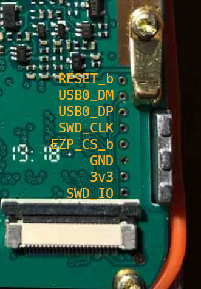
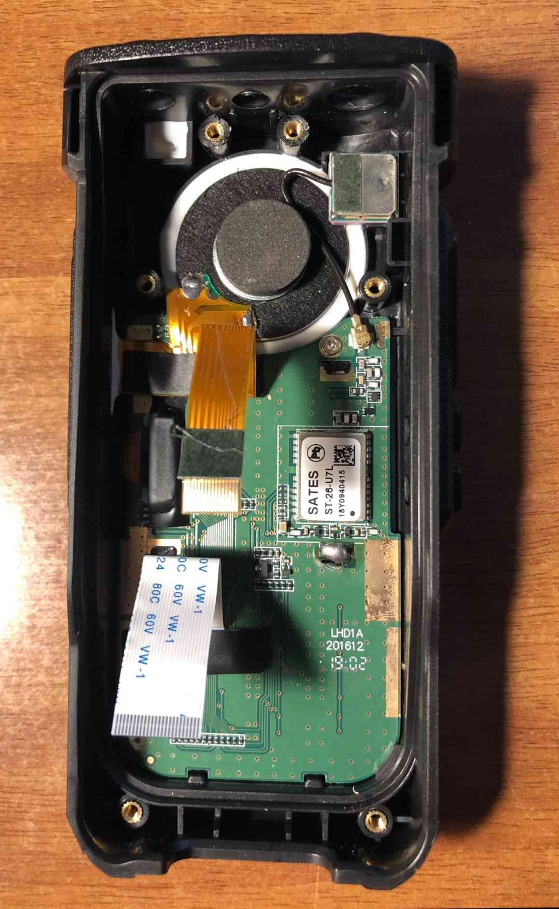
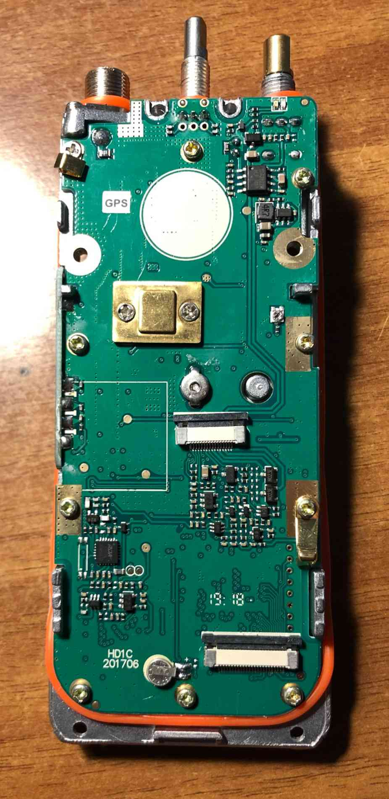
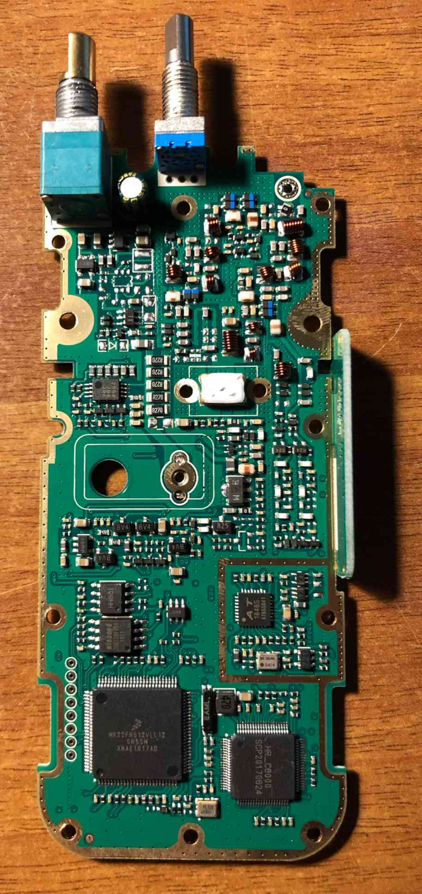

# Ailunce HD1

## Specifications

* MCU: NXP MK22FN512VLL12
* Baseband: Hongrui HR_C6000
* Display: 160x128 color TFT
* Frequency ranges
    * VHF: 136.0000-174.0000
    * UHF: 400.0000-480.0000

## Hardware Configuration

The Ailunce HD1 is very similar to the Radioddity GD77 in its hardware
configuration, schematics for this radio are public domain
and [can be accessed here](https://github.com/OpenRTX/OpenRTX-external-docs/raw/main/Schematics/Ailunce_HD1_schematic.pdf).

## Memory Mapping

|            Name          | Start Address | Length     |
|:------------------------:|---------------|------------|
| Internal Flash           | 0x0           | 0x00080000 |
| FlexBus                  | 0x08000000    | 0x08000000 |
| SRAM                     | 0x1C000000    | 0x04100000 |
| Program Flash (CPU only) | 0x30000000    | 0x04000000 |

## M17 Path

- MCU to RF:
    1) Generation of baseband signal via PWM modulator on pin 53 (RING/1750Hz) -> same mechanism of MD380
    2) Remove C51 and C389 to extend the signal bandwidth towards the AT1846S (probably not needed, testing required)

- RF to MCU:
    1) Connect pin 1 of U104 either to MCU pin 16 or pin 20 (ADC inputs) for sampling of incoming baseband signal, after amplification stage   
    2) Remove C370? -> extend bandwidth of incoming signal down to DC level, should have no impact on DMR

- Mic to MCU:    
    1) Usage of VOX signal    
    2) Remove C356, Q309, C355 -> removal of peak detector circuit, as in MD380    
    3) Keep R363 and add 100k resistor towards 3v3 -> add DC bias of VDD/2 to mic signal

- MCU to spk:
    1) Use HR_C6000 sound playback functionality, it should not be painful.

## Disassembly

TODO

## dmesg

USB cable is a serial adaptor, this log appears even without radio.

```
[ 5546.159081] usb 1-1: USB disconnect, device number 14
[ 5546.159387] pl2303 ttyUSB0: pl2303 converter now disconnected from ttyUSB0
[ 5546.159423] pl2303 1-1:1.0: device disconnected
[ 5547.298284] usb 1-1: new full-speed USB device number 15 using xhci_hcd
[ 5547.439883] usb 1-1: New USB device found, idVendor=067b, idProduct=2303, bcdDevice= 3.00
[ 5547.439896] usb 1-1: New USB device strings: Mfr=1, Product=2, SerialNumber=0
[ 5547.439902] usb 1-1: Product: USB-Serial Controller
[ 5547.439906] usb 1-1: Manufacturer: Prolific Technology Inc.
[ 5547.441501] pl2303 1-1:1.0: pl2303 converter detected
[ 5547.442577] usb 1-1: pl2303 converter now attached to ttyUSB0
```

## Debug Pads

| #Pad | MK22 Pin | Schematic Pin |
|:-----|----------|---------------|
| 1    | RESET_b  | ARM_RST       |
| 2    | USB0_DM  | USB0_DM       |
| 3    | USB0_DP  | USB0_DP       |
| 4    | SWD_CLK  | SWCLK         |
| 5    | EZP_CS_b | EZP_CS        |
| 6    | GND      | GND           |
| 7    | 3v3      | 3v3           |
| 8    | SWD_IO   | SWDIO         |



## CHORD U306

This chip is the voice synthesize from the baofeng radio

86 -> "Channel Mode"
85 -> "Frequency Mode"
60 -> "Zero"
62 -> "Two"
...
69 -> "Nine"
?  -> "Cancel"

## SWD

MK22 is supported by mainline OpenOCD, using `target/kx.cfg`.

## Bootloader

The bootloaded exposes a serial terminal accessible using the programming cable.
The serial port uses a 57600 baud rate.

This is the prompt shown by the bootloader:

```
========================== Main Menu =====================

= (C) COPYRIGHT 2015 XiaMen Sloan Electronic Technology CO.,LTD

= Press 1 to Update application

= Press 2 to View Version

= Press 3 to Execute program

==========================================================
```

If 1 is pressed the radio listens for a firmware upgrade.
If 2 is pressed the prompt is shown.
If 3 is pressed the main firmware is booted.

After a successful upgrade this screen is printed:

```
 Programming Completed Successfully!
--------------------------------
 Name: HD-HD1A-V1.7.7-GPS.bin
 Size: 397313     Bytes
-------------------
```

The firmware is sent in wrapped form.

To dump the firmware sent from the updater to the radio:
```
socat /dev/ttyUSB0,b57600,raw,echo=0 \
SYSTEM:'tee in.txt |socat - "PTY,link=/tmp/ttyV0,b57600,raw,echo=0,waitslave" |tee out.txt'
```

The bootloader uses the xmodem protocol
http://web.mit.edu/6.115/www/amulet/xmodem.htm

The first xmodem chunk sent by the PC to the radio is a non-standard xmodem packet since it's packet counter is 00, while the xmodem standard states that the packet counter should start from 01.

The first xmodem packet contains the name of the new firmware and the size in bytes

## Pictures

### Radio Cover



### PCB Front



### PCB Back



## References

- [MCU (NXP MK22FN512VLL12) Product Page](https://www.nxp.com/part/MK22FN512VLL12#/)
