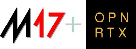

M17 is a new digital radio protocol in development as an alternative to those currently available, with freedom in mind. Freedom in the code, protocol, voice codecs, and hardware. The goal is to provide a better option for digital radios in the future.

The OpenRTX team is collaborating with M17 team to bring M17 protocol support to OpenRTX radios.

We want to make digital voice experimentation accessible on commodity hardware.

Follow the experimentation progress on the [M17 Twitter Account](https://twitter.com/m17_project).
