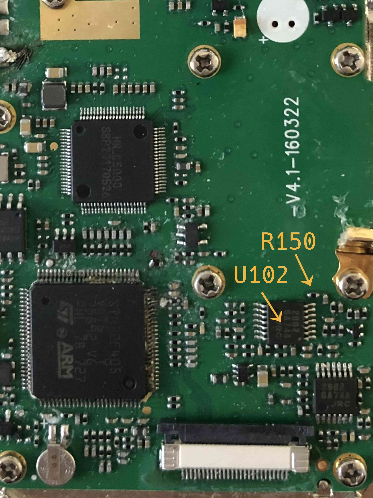

## M17 on the MD-380

We are bringing experimental M17 support to the TYT MD-380 DMR radio. However, due to technical limitations of the underlying hardware, transmitting M17 audio on the radio requires two small hardware modifications.

### Mic → MCU

The modification enables the MCU on the radio to directly access the audio signal coming from the microphone, bypassing the HR_C5000 normally used to sample microphone input.
We cannot use the HR_C5000 ADCs, because those can be accessed only in DMR mode, and we are leveraging HR_C5000 analog FM mode to transmit M17 data.

The MD-380 already has access to the microphone input, this is used for the VOX function in the original firmware, however this input is heavily filtered, which results in an analog bandwidth which is too narrow to be used for voice input.

We alter the analog filtering of the VOX input. The modification itself is quite small, we need to remove the EC151 capacitor and to bridge the top and right pins of the D102 diode.

This is the logic board of the TYT MD-380:

We are going to remove EC151 and bridge D102, this is a picture of the two components before the modification:

After the modification:

Lastly, since STM32 ADCs can only measure positive voltages, to be able to capture the full audio signal we need to apply a DC bias to the microphone signal.
We recommend to do so by applying a 200KΩ resistor between a 5V source and the microphone signal path, accessible on one of the pads of the EC151 capacitor we just removed.
If you don't have a 200KΩ resistor, anything in the range [180-220]KΩ will work.
5V will be sourced from the leftmost hole inside the white silkscreen circle, visible in the pictures.

Here is a picture of the applied modification:

This modification has a minor impact on the VOX functionality on any firmware different than OpenRTX. The VOX level 1 will be always open, higher VOX levels still work as expected. When VOX functionality will be implemented on OpenRTX, we'll take care to support both modified and unmodified MD-380 radios.

### RF → MCU

The MD380 already features a signal path from the FM demodulator to the MCU, marked on the schematic as 2T/5T, probably meant to be used for ZVEI Selcall, but never implemented in the original firmware.
This audio path however has a very narrow pass-band filter, and cannot be used as-is to demodulate M17.

We will break the original 2T/5T path by removing R150 and re-use the STM32 pin to create a new, unfiltered path, from the demodulator output, to one of the STM32 ADCs.

In this second part of the mod we'll be working on the lower right portion of the logic side of the PCB, in this picture you can see the unmodified portion of the radio:

First we will desolder R150: put some flux, heat one side of the resistor, slide it away on one side, heat the other side and slide it away on the other side, heat the pads to clean them up.
This is how the pads should look like after the resistor has been removed:

Afterward we will bridge with some Kynar wire the left pad of the resistor (2T/5T) with pin 1 of U101, which is the demodulator output. Here is a picture of the finished modification:

### Results

The MD380 PCB with both mods applied should look like this:

You can put some drops of hot glue to ensure that the resistor and the Kynar wire stay in place.

Now your radio is ready to modulate M17 and other digital protocols, stay tuned on [Discord](https://discord.gg/jZ9t8XTbmd) and [Twitter](https://twitter.com/OpenRtx)
to know when firmware support will be available!
