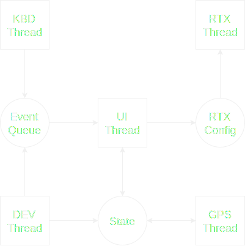

# OpenRTX

OpenRTX software architecture documentation

## Device taxonomy

* **MDx** family
    * **MD-3x0** platform, compilation target `md3x0`
        * Tytera MD380
        * Tytera MD380G
        * Tytera MD390
        * Tytera MD390G
        * Retevis RT3

    * **MD-UV3x0** platform, compilation target `mduv3x0`
        * Tytera MD-UV380
        * Tytera MD-UV380G
        * Tytera MD-UV390
        * Tytera MD-UV390G
        * Retevis RT3s (with or without GPS)
        * Baofeng DM-1701 (not tested)
        * Tytera MD-2017 (not tested)

    * **MD-9600** platform, compilation target `md9600`
        * Tytera MD-9600 (with or without GPS)

* **GDx** family
    * **GDx Platform**
        * Radioddity GD-77, compilation target `gd77`
        * Baofeng DM-1801,  compilation target `dm1801`

* **Module17** platform, compilation target `hd1`
   * Module17 board
 
* **Talkpod** family
   * **A36plus Platform**
        * Talkpod A36plus MAX (8W), compilation target `a36plus`

## Threading Model
OpenRTX employs a **multi-threaded** architecture. \
This allows to handle different concurrent operations while keeping the code complexity low,
because every self-contained operation is performed by a different thread.

The current implementation uses three threads:
- **UI Thread**: Draws the User Interface and handles button behaviour
- **DEV Thread**: Updates the device parameters (e.g. battery voltage) and handles parsing of GPS sentences
- **RTX Thread**: Controls the RF section and handles the protocol management, executing requests from the UI Thread

The OpenRTX threads communicate between them by using _event queues_ and _shared state_ data structures.

This diagram shows the interaction between threads, queues and shared states.



Some OpenRTX threads are _event-based_, other are executed at _regular intervals_, see the
following table for details

|Thread|Interval   |Event         |Stack size|
|:-----|:----------|:-------------|:---------|
|UI    |40Hz (25ms)|KBD and DEV   |2kB       |
|DEV   |200Hz (5ms)|-             |2kB       |
|RTX   |33Hz (30ms)|-             |512B      |

The thread stack sizes are defined in the `openrtx/include/threads.h` file, **except for the DEV one**. The DEV task is currently run in the ```main()``` function, whose stack size depends on a configuration parameter of the miosix kernel and is thus non modifiable. The only way to effectively change the stack size for the ```main()``` function is to recompile the miosix kernel and change the file `lib/miosix-kernel/libmiosix.a`.

## Interfaces Overview
The OpenRTX firmware has been designed also with the goal of being able to be run on many different models of ham radios. To allow for this interoperability, we defined a set of **standard interfaces** providing a well-defined decoupling point between the common code (like the one for UI management) and the platform-specific one, most notably the device drivers.
Each _device-specific_ driver, then, provides an implementation of the _general_ interface APIs.

Below is provided a list of the interfaces files with a short description: the complete header files can be found in the OpenRTX source code, in the `openrtx/include/interfaces` folder.
- `delays.h`: Interface for adding time delays in the code
- `gpio.h`: Interface for configuring and using GPIO pins
- `graphics.h`: Interface for drawing and writing on a screen
- `nvmem.h`: Interface for reading and writing to the external non volatile memory, documented [here](./NVM.md).
- `radio.h`: Interface to interact with RF hardware
- `display.h`: Interface for low-level display setup and access
- `gps.h`: Interface for reading location data from GPS modules
- `keyboard.h`: Interface for reading keypads and buttons
- `platform.h`: Interface for _device-specific_ hardware not managed in other interfaces
- `rtc.h`: Interface for real-time clock devices

## Code guidelines and notes
### General considerations about thread safety
By design, low level drivers (display, keyboard, ...) are **not** written to be thread-safe: concurrent access to hardware resources has to be managed by the upper level modules (e.g. graphics driver has to take care of concurrent access to display). Moving the burden of guaranteeing thread safety to high level modules simplifies the software development process, since code for thread safe operation has to be designed, written and tested only once and for all. Porting to a new platform, then, is only matter of writing functioning (and optimised) code for low level drivers.

In any case, the low level drivers provide a means to determine if the controlled device is busy, thus allowing for concurrent access management. As said above, since the low level drivers are **not** thread safe, these functions should be preceded by ```__disable_irq()``` and followed by ```__enable_irq()```, which are the CMSIS functions for interrupt disabling and enabling, respectively. Disabling the interrupts prevents any kind of unwanted preemption, either from the RTOS or from the hardware peripherals. However, it also has an impact on the real-time performance of the overall system, thus each critical section has to be as short as possible.

As an example, let consider the display driver's function to check if rendering is in progress:

```C

[...]

bool inProgress = false;

__disable_irq();
inProgress = display_renderingInProgress();
__enable_irq();

[...]

```

### Parts with C++ code in the codebase
As the miosix kernel is completely written in C++ and designed primarily to be coupled to C++ sources, some points of the OpenRTX codebase have to be adapted to be able to interface with the kernel. In particular, all the names for the interrupt handler functions are subjected to the **C++ name mangling scheme**, thus all the C code written for handling interrupts must have the handler name matched with the C++ mangled one. Affected modules are:
* The `HX8353_MDx` file, providing the low-level display driver for MDx targets.
* The `GPS_MDx` file, providing the low-level GPS driver for MDx targets.
* The `toneGenerator_MDx` file, providing an implementation of a tone generator for system "beeps" and CTC/DCS.

In case there is need to interface with an interrupt handler from the C code, the general name mangling scheme is the following:
* The function name is prefixed with `_Z` and **the number of characters the name itself is composed of**.
* The function name is kept unchanged.
* The function name is suffixed with `v`.

As an example, take the TIM3 interrupt handler: its function name is ```TIM3_IRQHandler()```, while its C name according to the C++ name mangling scheme is ```_Z15TIM3_IRQHandlerv```.

### Target-specific programming notes
#### MD-380 and MD-UV380
* Keyboard and display share some data lines, thus ```kbd_getKeys()``` **must not** be called simultaneously with ```display_renderRows() ``` or ```display_render() ```. The display driver provides a function which allows to check if rendering is in progress while, for the keyboard one, the fact that the I/O lines are taken busy by the driver is implicit in having the execution flow inside ```kbd_getKeys() ```.
* Display framebuffer should not be written to while a rendering is in progress. Framebuffer is copied to the screen through DMA and it has been observed that, if the buffer is written while a DMA transfer is in progress, following calls to ```display_renderRows() ``` or ```display_render() ``` may have no effect, due to having DMA screwed up in a wrong state.
* Content of display framebuffer is changed inside ```display_renderRows() ``` or ```display_render() ```. Since the display controller needs to be provided with pixel data in big endian order, while the MCU is little endian, inside the two render functions the whole content of the framebuffer is byte-swapped to accommodate for the endianness of the display controller. As a consequence, writing a pixel and then reading it back returns the written value **as long as** ```display_renderRows() ``` **or** ```display_render() ``` **are not called**.

#### MD-380
* SKY73210 and HR_C5000 share part of the SPI bus. SKY73210 provides ```SKY73210_spiInUse()``` function to allow high level modules determine if SPI bus is taken by PLL driver or not.

#### MD-9600
* The external flash memory and the display driver share the same SPI bus. The SPI2 driver module provides an API to get exclusive access to the bus by locking a dedicated mutex, however application code has to explicitly call the ```spi2_lockDevice()```/ ```spi2_lockDeviceBlocking()``` and ```spi2_releaseDevice()``` functions, respectively before and after committing a transaction on the SPI bus.

#### GD-77 and DM-1801
* The EEPROM memory module and the AT1846S chip share the same I2C bus. The I2C0 driver module provides an API to get exclusive access to the bus by locking a dedicated mutex, however application code has to explicitly call the ```i2c0_lockDevice()```/ ```i2c0_lockDeviceBlocking()``` and ```i2c0_releaseDevice()``` functions, respectively before and after committing a transaction on the I2C bus.

## Debugging with COM port

Devices using the `STM32F4` series MCU (e.g. TYT MD UV380) are able to print to a com terminal for debugging. In order to include this in your build, update `meson.build` to define a `ENABLE_STDIO` constant. For example, see the patch below:

```meson
--- a/meson.build
+++ b/meson.build
@@ -9,7 +9,7 @@ project('OpenRTX', ['c', 'cpp'],
 ## Optional defines, common to all souces (e.g. to enable debugging)
 ##
 
-openrtx_def = {}
+openrtx_def = {'ENABLE_STDIO': ''}
 
 ##
 ## UI font configuration, only one uncommented at a time
```

Once this is in place, add `printf()` statements to the source code in order to send messages to the debug virtual COM port.

From the host machine, when the device is running you should see a COM port created. STM says from Windows 10 and on, the built-in drivers will work; mainstream linux distributions also shouldn't have any special requirements. For example, for opening the debug port from Linux, use `screen /dev/ttyACM0 115200`.

Note that printf uses a lot of stack, so debugging may benefit from increasing the stack size for the relevant thread in `openrtx/include/core/threads.h`.
